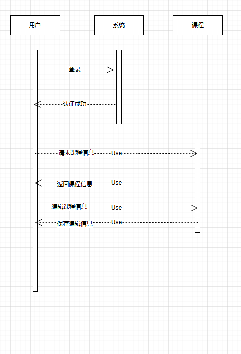
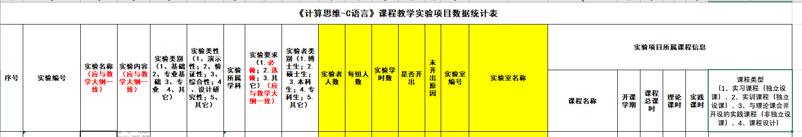

# 填报系统

## 技术栈

前端，vue
后端 springboot + excel？？？

EasyExcel（更好） / POI

## 前端

登录页面

课程管理
1. 查询页面
2. 编辑页面

统计管理
1. 完成情况统计
2. 下载统计情况

## 后端

登录 token

课程      查询 ，修改

统计

## token

描述的是用户通过后端进行登录，后端派发限时有效的身份令牌
后续用户通过该令牌向服务器表明身份，如果令牌验证不通过，则不向其提供服务。

### 前端
通过登录功能，获取并缓存来自服务器的token，如果不缓存token，则下一次访问后端服务时，无法验证用户身份，则会出发再次登录。

token放到哪里？
localstorage，在页面关闭后，再打开，是否有效？

### 后端

负责token的派发，验证功能。

1. 添加依赖

2. 创建jwt工具类

3. 配置springSecurity 加强后端的安全

4,创建认证接口

5. 修改配置文件

## 工作流



## 数据库设计

### 实验项目表



### 总表
``` text
序号	学年	学期	开课类型	开课学院	课程代码	课程名称	学分	场地类别	任务落实时间	教学班	是否主教学班	是否合班标记	主教学班	教学班组成	教学班人数	教学班容量	选课人数	教职工信息	教师部门	教工号	教师名称	任务序号	教师性别	教师出生日期	成绩录入教师	周学时	起始结束周	起始周	结束周	排课起始结束周	排课起始周	排课结束周	课程结束时间	学时类型	任务总学时	已排课学时	课程周学时	课程总学时	课程理论总学时	课程实践总学时	课程类别	课程性质	开课状态	上课时间	教学地点	专业方向	正常选课人数	非重修选课人数	是否排课	重修跟班人数	合并数量	授课对象所属学院	年级组成	专业组成	是否主讲
```

### 角色

教师，管理员

### 用户表

id 工号 密码 role

